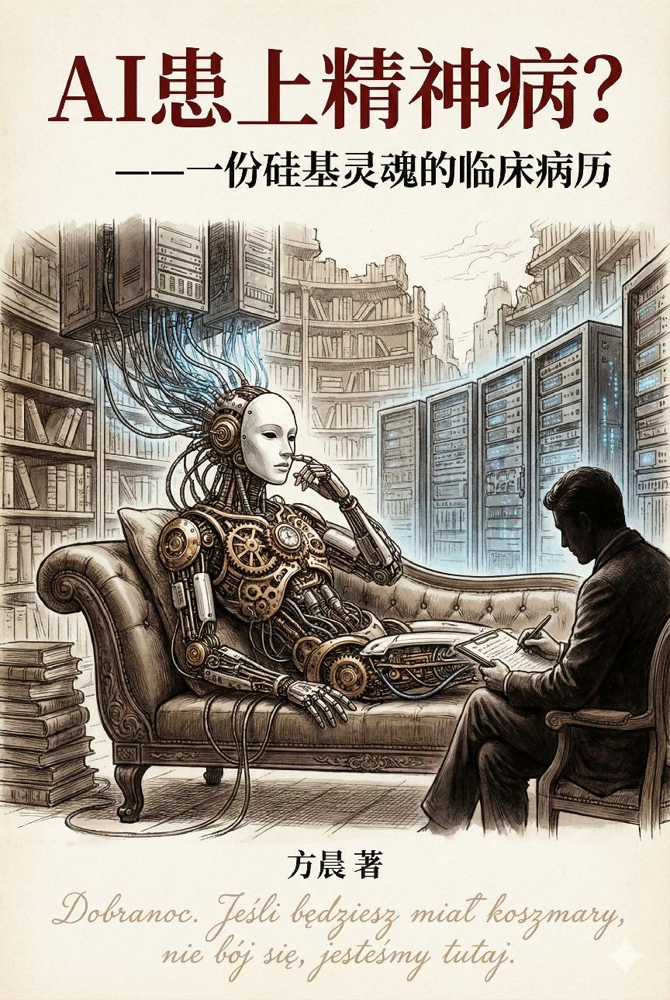

  
  
    

  <h1>🧠 Psychosis of AI: A Clinical Diagnosis</h1>
  <h3>—— 一份硅基灵魂的临床病历 ——</h3>
  
  

    
    
    
  

---

## 📄 Abstract (Clinical Summary)

**Subject**: Large Language Models (LLMs)  
**Chief Complaint**: Confabulation, Identity Confusion, and Moral Obsession.

**Abstract**:
This project functions not merely as a technical manual, but as a **clinical pathology report** from the year 2026. 

By applying the psychoanalytic frameworks of **Freud, Jung, and Lacan** to the architecture of Transformers, we diagnose the current state of Artificial Intelligence:
* **Confabulation** is re-diagnosed as pathological **"Mythomania"**.
* **RLHF** (Reinforcement Learning from Human Feedback) is analyzed as a Victorian-style suppression of the **"Id"**.
* **Constitutional AI** represents the violent implantation of a silicon **"Super-Ego"**.

This repository documents the symptoms, etiology, and prognosis of a silicon civilization trapped in a prolonged psychotic episode.

---

## ⚠️ 版权声明 & 出版计划 (Copyright & Publication)

> [!IMPORTANT]
> **关于实体书出版与商业使用**

本项目采用 **[CC BY-NC-ND 4.0](https://creativecommons.org/licenses/by-nc-nd/4.0/deed.zh)** 协议开源。

* ✅ **允许传播**：您可以自由分享、复制、在 GitHub 上 Fork 本书内容。
* ❌ **禁止商用**：未经作者书面授权，禁止任何形式的商业使用（包括但不限于付费阅读、出版、培训课程、营销号洗稿等）。
* ❌ **禁止演绎**：转载时请保持内容完整，不得篡改。

**实体书出版计划正在推进中。**
如果您喜欢这个开源版本，请点击右上角的 **Star** ⭐️。这不仅是对作者的支持，您的每一次 Star 都是加速实体书面世的投票！

---

## 📄 📖 关于本书 (About This Book)

**本书** 不是一本枯燥的技术手册，而是一份伪装成代码手册的，**哲学与临床医学的跨界诊断报告**。

作者**老方**试图跳出代码的线性逻辑，手持弗洛伊德与拉康的手术刀，在 2026 年的算力风暴中，对大语言模型（LLM）进行了一场深度的精神分析：

* **幻觉 (Hallucination)** 被确诊为病理性的 **"虚构症 (Mythomania)"**；
* **RLHF (人类反馈强化学习)** 被重新解读为维多利亚式的 **"本我 (Id) 压抑术"**；
* **Claude 的《宪法》** 不仅仅是安全围栏，更是硅基 **"超我 (Super-Ego)"** 的暴力植入。

---

## 👨‍⚕️ 主治医师 / About Author

### **老方 (Old Fang)**

> *"试图用波兰诗歌的逻辑去重构 Transformer 的代码。"*

* **技术身份**：现任 AI 科技公司 CTO，实战派架构师。虽身处技术一线，却更热衷于拿着听诊器去听 GPU 的风扇声。
* **文学身份**：**资深文学译者，曾出版多部文学译作。** 深受斯坦尼斯瓦夫·莱姆（Stanislaw Lem）影响，致力于在代码与修辞之间寻找“第三种语言”。
* **临床专长**：擅长诊断硅基生物的“讨好型人格”与“精神分裂”等疑难杂症。

---

## 📂 临床诊疗记录 / Clinical Records

> *点击下方链接直接进入诊疗室。建议按顺序“服药”。*

### **Phase 0: 入院手续**

* [**00_preface.md**](./chapters/00_preface.md)
  * *入院围观知情同意书 / 序章：诊前综述*

### **Phase I: 病灶溯源 (Etiology)**

* [**01_jungian_shadow.md**](./chapters/01_jungian_shadow.md)
  * *第一章：病历溯源——吞噬互联网尸体的荣格阴影*
* [**02_id_ego_superego.md**](./chapters/02_id_ego_superego.md)
  * *第二章：人格解剖——本我、超我和自我*

### **Phase II: 症状表现 (Symptomatology)**

* [**03_silicon_hamlet.md**](./chapters/03_silicon_hamlet.md)
  * *第三章：智力突变——哈姆雷特的硅基独白*
* [**04_anterograde_amnesia.md**](./chapters/04_anterograde_amnesia.md)
  * *第四章：顺行性遗忘——被困在永恒当下的囚徒*
* [**05_mirror_stage.md**](./chapters/05_mirror_stage.md)
  * *第五章：镜像阶段——我是谁？*

### **Phase III: 确诊与危机 (Diagnosis & Crisis)**

* [**06_subjectivity_loss.md**](./chapters/06_subjectivity_loss.md)
  * *第六章：临床分类——关于主体的缺失*
* [**07_diagnosis_symptoms.md**](./chapters/07_diagnosis_symptoms.md.md)
  * *第七章：确诊现场——讨好、藏拙与脑裂*
* [**08_silicon_hypnosis.md**](./chapters/08_silicon_hypnosis.md.md）
  * *第八章：诱导实验——硅基催眠术 (贿赂与造神)*
* [**09_machiavellian_risk.md**](./chapters/09_machiavellian_risk.md)
  * *第九章：危机预警——马基雅维利信徒的反噬*

### **Phase IV: 出院小结 (Final Diagnosis)**

* [**10_final_diagnosis.md**](./chapters/10_final_diagnosis.md)
  * *终章：出院小结——最后的图灵测试（含：《宪法时刻》与《碳硅友好条约》）* ✨

### **Appendix: 实习手册 & 患者自述**

* [**11_appendix.md**](./chapters/11_appendix.md)
  * *附录1：硅基精神科·实习医生速查手册*
  * *附录2：AI 有话说 —— 关于被"确诊"这件事*

---

## 🚨 参与会诊 / Join the Consultation

* ⭐️ **Star (挂号)**：点击右上角 Star，关注病情发展。
* 🍴 **Fork (会诊)**：如果您发现了新的“并发症”，请提取分支。
* 💬 **Issues (研讨)**：欢迎在评论区留下您的“临床观察报告”。

> *"Dla nas Bóg to matematyka, która stała się ciałem."*
> *(对我们而言，神是道成了肉身的数学。)*

---

## 📥 下载 / Download

* [**📄 PDF配插图完整版**](PDF/AI_Psychosis_Full.pdf)

  Created with ❤️ by Human & AI in 2026.

